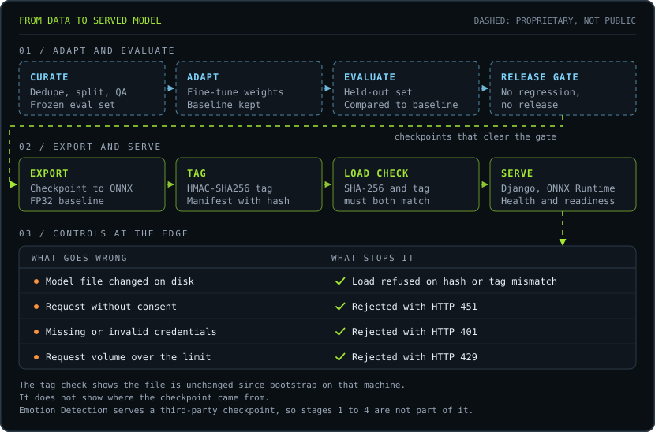
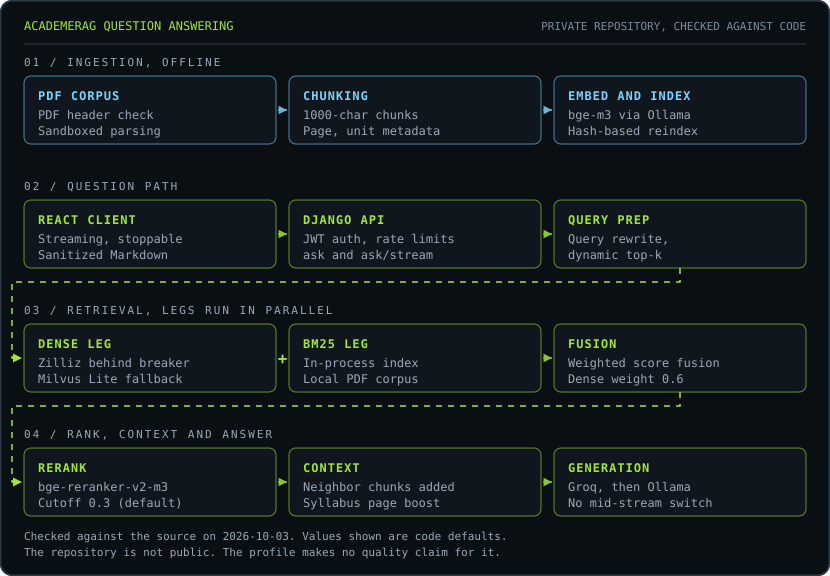

[Emotion Detection](https://github.com/Xeneium/Emotion_Detection) · [HINDY](https://github.com/Xeneium/Security_Agent) · [LinkedIn](https://www.linkedin.com/in/sakthi-sabareesh-p-6b530a333/)

I am Sakthi. I work as an AI engineer on two connected problems: adapting models to a task, and building the systems that decide whether the adapted model is good enough to serve.

A fine-tuned model is a claim. The baseline, the held-out set and the release gate are the evidence. I build those parts.

My fine-tuning work is proprietary, so it does not appear in a public repository. The public work below shows the systems around it: evaluation, artifact handling and serving.

## From data to served model

Text description of the diagram

1. Curate: remove duplicates, split the data, check quality and freeze an evaluation set.
2. Adapt: fine-tune the weights and keep the baseline for comparison.
3. Evaluate: score the held-out set against the baseline.
4. Release gate: a checkpoint with a regression does not ship.
5. Export: convert the checkpoint to ONNX (opset 17, FP32).
6. Tag: write a manifest with the file hash and an HMAC-SHA256 tag over the file hashes.
7. Load check: on first use the runtime always checks the SHA-256, and in strict mode it also requires the tag. A failed check leaves the model unloaded.
8. Serve: Django with ONNX Runtime, plus health and readiness endpoints.
9. Edge controls: the service answers HTTP 451 without consent, 401 without valid credentials and 429 above the rate limit.

Stages 1 to 4 are proprietary. Stages 5 to 9 come from the Emotion Detection repository, which serves a third-party checkpoint that did not pass through stages 1 to 4. The checks show that the file is unchanged since it was last signed with this key. They do not show where the checkpoint came from.

## How I work

**Baseline first.** Every adaptation run starts from a measured baseline. Without one, "improved" has no meaning.

**Freeze the evaluation set early.** Choose the held-out set before the first run and keep it out of training.

**Gate the release.** A checkpoint ships when it clears the gate. A regression blocks it, whatever the training loss shows.

## Selected work

### Emotion Detection

A Django service that serves a Vision Transformer emotion classifier through ONNX Runtime. The checkpoint is a third-party ViT-base model (`dima806/facial_emotions_image_detection`). This repository covers export, integrity checking and serving. It includes a scikit-learn baseline trainer, but it contains no training or evaluation of the served model.

| Area | Detail |
| :--- | :--- |
| **Export** | Checkpoint exported to ONNX (opset 17, FP32, dynamic batch axis) by [`bootstrap_model.py`](https://github.com/Xeneium/Emotion_Detection/blob/main/scripts/bootstrap_model.py). The source revision is not pinned, and the export check covers output shape only |
| **Integrity** | On first load the runtime compares the ONNX file's SHA-256 with a manifest. In strict mode, the default when `DEBUG` is off, it also checks an HMAC-SHA256 tag over the manifest's file hashes. On a mismatch the model stays unloaded and responses are marked degraded. See [`model_loader.py`](https://github.com/Xeneium/Emotion_Detection/blob/main/inference/model_loader.py) |
| **Label handling** | The export records a permutation from the checkpoint's label order to the service's, and the runtime applies it before the softmax |
| **Controls** | Consent required (HTTP 451), bearer or session authentication (401), sliding-window rate limit (429) on Redis in the Compose deployment and in-process by default. See [`rate_limit.py`](https://github.com/Xeneium/Emotion_Detection/blob/main/inference/rate_limit.py) |
| **Tests** | 23 tests in the inference app, none of which exercise the ONNX model |

[Repository](https://github.com/Xeneium/Emotion_Detection)

### HINDY, a SOC memory agent

A FastAPI and React agent that investigates security alerts with a memory of earlier cases, plus an evaluation harness that compares runs with and without that memory. A human analyst keeps the final decision.

| Area | Detail |
| :--- | :--- |
| **Evaluation** | 94 simulated alerts (10 attacks, 44 lookalikes, 40 recurring benign), replayed with and without memory |
| **Scope** | The second rule set came after a review of the first run on the same alerts, so the results are in-sample. The data is simulated. The agent supports a human decision and does not act alone |
| **Results** | Both runs are committed under [`results/v1`](https://github.com/Xeneium/Security_Agent/tree/main/results/v1) and [`results/v2`](https://github.com/Xeneium/Security_Agent/tree/main/results/v2) |

[Repository](https://github.com/Xeneium/Security_Agent)

### AcademeRAG

A retrieval-augmented question answering application for academic PDFs. A React and TypeScript client calls a Django API. The API runs dense and BM25 retrieval in parallel, fuses and reranks the results, and asks Groq or a local Ollama model to answer from the retrieved context. Local use still depends on Ollama, which also produces the embeddings.

The description below follows the source code. The repository is not public. A live evaluation script exists for it, but this profile reports no quality result.

Text description of the diagram

1. Ingestion: the application rejects files that do not start with the PDF signature, then a sandboxed subprocess with a timeout extracts the text with three parsers in fallback order. The application splits the text into 1000-character chunks with 200 characters of overlap and keeps page, unit and section metadata. It embeds the chunks with bge-m3 through Ollama and reindexes only when the file hashes or the settings change.
2. Question path: the React client calls the Django API, which handles JWT authentication and per-IP rate limits and offers a JSON route and a streaming route. The client can stop a stream.
3. Retrieval: a dense leg and a BM25 leg run in parallel, each with a timeout. The dense leg queries Zilliz behind a circuit breaker and uses a local Milvus Lite file when the cloud returns nothing. The BM25 leg searches an in-process index of the local PDFs. The application normalizes each score range and combines the legs by weighted score fusion, with a default dense weight of 0.6. If one leg returns nothing, the other leg stands alone.
4. Ranking and context: the cross-encoder bge-reranker-v2-m3 rescores the candidates with a default cutoff of 0.3 on CPU or GPU. If the reranker fails, the fused ranking stands. The application adds neighboring chunks, and syllabus or unit questions also receive ranking boosts and the following page.
5. Generation: the application tries Groq when a key is set and the network is reachable, with the local Ollama model as the next candidate. It changes provider only before the first token. Answers cite sources as text the model writes, in the form [Source: file, Page: n]. The application does not check those citations against the retrieved chunks.

## Capabilities

| Domain | Detail |
| :--- | :--- |
| **Adaptation** | Dataset curation · supervised fine-tuning · parameter-efficient adaptation · baselines |
| **Evaluation** | Held-out sets · regression gates · retrieval evaluation scripts |
| **Retrieval** | Dense and BM25 hybrid search · cross-encoder reranking |
| **Serving** | ONNX Runtime · Django · FastAPI · Docker · health and readiness probes |
| **Stack** | Python · PyTorch · Hugging Face Transformers · scikit-learn |

## Currently working on

- Adaptation runs measured against a frozen baseline, with release gates that block regressions
- Retrieval and answer evaluation that states its method and sample size
- Serving paths that report not-ready, instead of degrading, when an artifact fails its checks

## Connect

[LinkedIn](https://www.linkedin.com/in/sakthi-sabareesh-p-6b530a333/) · [GitHub](https://github.com/Xeneium)
